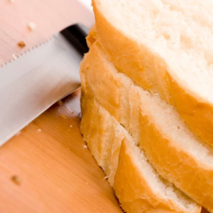
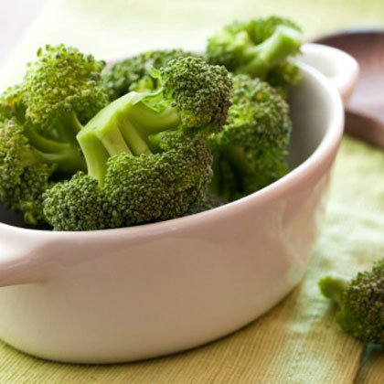
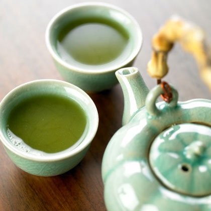
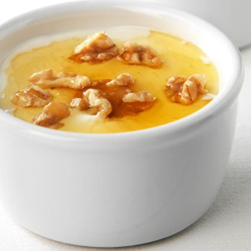
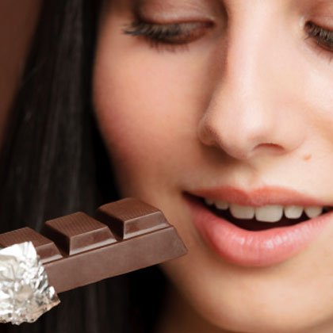
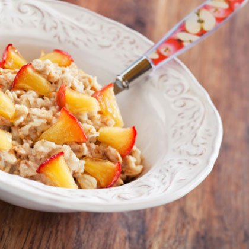

### Get Strong, Not Skinny

Illness or injury may often be the instigator, but frailty is what kills us, says Dr. Mehmet Oz, cardiothoracic surgeon, author, and host of The Dr. Oz Show. Our bodies can't recover as well if we're not strong, which is why he recommends a balanced workout plan that includes strength, cardio, and flexibility training. This doesn't mean you need to spend hours in the gym each week. The busy doctor has no problem fitting in his seven-minute workout every morning (check out the full routine here), which he says is better for you than the occasional hour-long gym session. And you can say goodbye to boring treadmill sessions. Instead, Dr. Oz suggests getting a basic pedometer and setting a goal of 10,000 steps per day (that's about five miles) to stay slim and healthy.

### Cut Out the White Stuff
<figure>
	
</figure>
The easiest way to lose weight and improve your health? Ditch the white stuff! Most white foods (bread, rice, pasta, sugar, flour) are primarily made up of refined carbs and empty calories, so cutting them out of your diet is one of the quickest ways to shed pounds and improve your well-being, Dr. Oz says.corporate health and wellness ideas. There are a few exceptions to the rule, including egg whites, cauliflower, and fish, he says. Those are the only white foods you should have on hand.

### Bring On the Broccoli
<figure>
	
</figure>
They may be chock-full of nutrients, but exotic vegetables like celeriac and Jerusalem artichokes don't always appeal to more traditional pallets. And that's fine, according to Dr. Oz, who says broccoli is his all-time favorite produce. "Broccoli is the best produce option because it cleanses the liver and helps to fight cancer," he says. To reap the most rewards, the doctor suggests cleaning and slicing cruciferous veggies (like broccoli) five to 10 minutes before cooking, and then steaming or microwaving them (instead of boiling) to help retain the most cancer-fighting compounds.

### Get Your Daily Dose of D
<figure>
	
</figure>
"New research says that vitamin D may play a crucial role in weight loss by controlling appetite and helping fat cells become more metabolically active," Dr. Oz says. The sunshine vitamin also helps your body better absorb bone-boosting calcium, improves immunity, reduces inflammation, and may even protect against some forms of cancer. Nearly 75 percent of Americans are vitamin-D deficient, so there's a good chance you're not getting your recommended daily dose of 400 IU (some people may need as much as 1000 IU, so check with your doctor to find out what's right for you).

### Drink More Water
<figure>
	
</figure>
There's a reason Dr. Oz can't omit this expected tip from the list. Drinking water is so imperative for staying healthy, energized, and even losing weight. There are so many reasons to stay hydrated—hunger is often disguised as thirst, it boosts your metabolism, and water is the best energy drink available, he says. To find out exactly how much water you should be drinking, divide your body weight (in pounds) by two and aim to drink that many ounces of water every day.

### Trade Supplements for Tea
<figure>
	
</figure>
Drinking all-natural green tea is an excellent way to boost your weight loss and your health. Not only does it have the power to stoke your metabolism, but it also contains the highest concentration of catechins, antioxidants found in plants that have been found to protect against heart disease and even some cancers. Sip on a few cups of green tea throughout the day to get all of its amazing benefits. Not a fan of tea? You can still reap the rewards! Try one (or all) of these creative ways to work green tea into your diet.

### Focus on Nutrients, Not Calories
<figure>
	
</figure>
While the amount of calories you consume is crucial for weight loss, the quality of your food is often more important (and often ignored). "Losing weight isn't all about cutting calories. Your brain is looking for nutrients, not calories, and [your brain] will prod you to eat until you're satisfied," says Dr. Oz, who cites a recent landmark study published in the New England Journal of Medicine that found specific foods, not just their calorie content, influence weight gain. These results aren't exactly ground-breaking, but they confirm what weight-loss experts have been recommending for years.

### Delay Dessert
<figure>
	
</figure>
You don't need to completely eliminate dessert (Dr. Oz says it's perfectly okay to indulge your sweet tooth in moderation), just try not to indulge immediately after dinner. "Avoid sweets directly after a meal since sugar disrupts the absorption of nutrients," Dr. Oz says. The best time for a sweet treat is about two hours after you finish your meal. And when it comes to what you eat, try the good doctor's go-to dessert: dark chocolate. "The flavonols found in cocoa improve circulation and increase blood flow to the brain, which helps you see more clearly," he says. (We also love these amazingly delicious—and nutritious—gluten-free goodies).

### Sleep More to Slim Down
<figure>
	
</figure>
The old saying 'you snooze, you lose' couldn't be more accurate when it comes to shedding pounds. According to Dr. Oz, depriving your body of sleep can speed up the aging process and deter your weight-loss efforts. "The brain craves carbohydrates when you're tired, so you could unknowingly sabotage even the best laid plans," he says. Aim for a good seven hours (minimum) of shuteye every night to allow your body to restore and to protect vital organ functions.

### Make Breakfast Mandatory
<figure>
	
</figure>
You've heard it before, but it's worth repeating: Breakfast is still the most important meal of the day! "Skipping the first meal of the day can increase risk for obesity more than fourfold," Dr. Oz says. "If you don't eat right when you wake up, your body senses a famine is coming and slows your metabolism to compensate. Then, when your body is presented with food later, it's ravenous and wants to pack it in, leading to bingeing with a slow metabolism—a recipe for weight gain."

