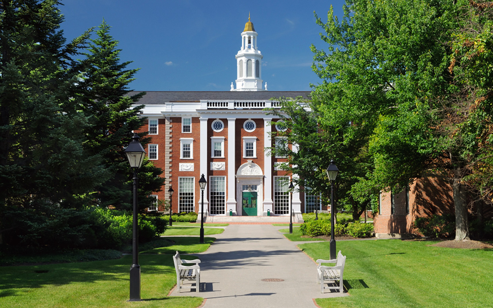

# MIT UNIVERSITY #

### ABOUT ###

The mission of the Massachusetts Institute of Technology is to propel learning and instruct understudies in science, innovation, and different zones of grant that will best serve the country and the world in the 21st century. We are additionally headed to apply learning as a powerful influence for the world's extraordinary difficulties. The Institute is a free, coeducational, secretly invested college, sorted out into five Schools (design and arranging; building; humanities, expressions, and sociologies; administration; and science). It has somewhere in the range of 1,000 employees, more than 11,000 undergrad and graduate understudies, and more than 130,000 living graduated class. At its establishing in 1861, MIT was an instructive development, a group of hands-on issue solvers in affection with principal science and anxious to improve the world a place. Today, that soul still aides how we instruct understudies on grounds and how we shape new advanced learning advances to make MIT instructing open to a great many learners around the globe. MIT's soul of interdisciplinary investigation has energized numerous experimental achievements and mechanical advances. A couple of cases: the principal compound union of penicillin and vitamin A. The improvement of radar and production of inertial direction frameworks. The innovation of attractive center memory, which empowered the improvement of advanced PCs. Real commitments to the Human Genome Project. The revelation of quarks. The development of the electronic spreadsheet and of encryption frameworks that empower e-trade. The formation of GPS. Spearheading 3D printing. The idea of the growing universe. Flow research and training territories incorporate computerized learning; nanotechnology; practical vitality, the earth, atmosphere adjustment, and worldwide water and sustenance security; Big Data, cybersecurity, mechanical technology, and counterfeit consciousness; human wellbeing, including tumor, HIV, a mental imbalance, Alzheimer's, and dyslexia; natural designing and CRISPR innovation; destitution mitigation; propelled assembling; and development and business enterprise. MIT's effect additionally incorporates the work of our graduated class. One way MIT graduates drive advance is by beginning organizations that convey new thoughts to the world. A late study assesses that starting 2014, living MIT graduated class have propelled more than 30,000 dynamic organizations, making 4.6 million occupations and producing generally $1.9 trillion in yearly income. Taken together, this "MIT Nation" is proportionate to the tenth biggest economy on the planet!

### Academics @ MIT ###

MIT is one of the best places on the planet to be an understudy.

### Incredible Faculty ###

We are an examination college that places a lot of accentuation on undergrad instruction. There are 21 MacArthur Genius Grant Fellows, 9 Nobel Prize Laureates, and 2 Pulitzer Prize victors, among numerous different lights, at present on our workforce, and every one of them show college courses. Truth be told, all classes at MIT are educated by recognized educators since we trust that you ought to gain from the absolute best from the minute you step foot on grounds. That is the reason people like Eric Lander, father of the Human Genome Project, educates starting science.

### Student Collaboration ###

MIT additionally has a solid culture of understudy coordinated effort. Understudies are urged and anticipated that would work with each other on homework - or psets, in MIT speech. For any given pset, you likely won't have the capacity to do everything all alone, so you'll discover (or make) a couple of companions in the class and go cooperate to complete it. We do this since it's the manner by which issues are comprehended in this present reality - by little groups of brilliant individuals contributing their individual skill and comprehension. When you move on from MIT and go to work at a Fortune 500 organization or a philanthropic, or as a business person conveying a lift pitch, you're going to need to know how to function with others. So that is you'll main event here at MIT.

### Research @ MIT ###

MIT understudies have unparalleled chances to take part in forefront look into as students.

### Undergrad Research Opportunities Program ###

The leader MIT understudy scrutinize program is UROP. When you do a UROP, you will discover a teacher who is dealing with something that you believe is amazing. You and the Professor will take a shot at a proposition, and afterward you will join their group. 89% of MIT understudies will take an interest in the UROP program at MIT. A number of them will be credited as co-creators on associate evaluated productions. Some even procure licenses - our Technology Licensing Office has marked 50-75 choice and permit understandings consistently for as long as five years. By the case of their own lives, a pivotal part of what our employees educate is the "intuition" for top of the line examine: the taught interest, the contemptuous innovativeness, the interminable capacity to continue on. At MIT, those aptitudes and qualities are as much a part of the air as oxygen.

Look into labs at which you could seek after a UROP include:

1. The Center for Civic Media, which grows new advancements that bolster urban media and activism.

2. The Koch Institute for Integrative Cancer Research, a $100 million dollar National Cancer Institute assign.

3. D-Lab, which creates feasible advancements and answers for issues in the creating scene.

4. GAMBIT, a global computer game outline/improvement research center.

5. MIT's atomic reactor, which conducts progressed, interdisciplinary research on materials science and radiation treatment in addition many different research centers crosswise over grounds.

FOR MORE INFORMATION
<button><a href="http://web.mit.edu/">VISIT OFFICIAL WEBSITE</a></button>

[Cic](/topten/background-image/)
